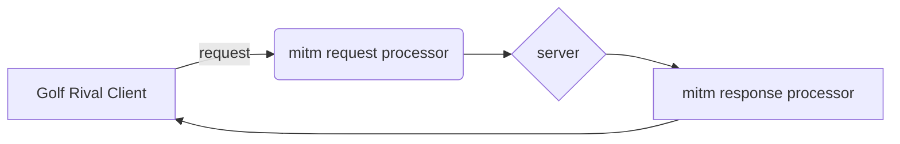

# Golf Rival API Hack

# How this works
Using a man in the middle proxy server I am able to intercept client to server communications and modify the requests and responses. In some instances the client does not validate the response and allows for these 'hacks' to be effective.

# How to stop this??!
## SSL pinning
If Golf Rival used [SSL Pinning](https://dzone.com/refcardz/securing-mobile-applications-with-cert-pinning) it would remove my ability to do this completely.
This method is used by the Apple developers when buying anything in app. This has prevented all attempts at intercepting purchase requests or responses.

## Hashing/Validation

If Golf Rival used a hashing mechanism to validate server and client payloads this could be mitigated. I must caution the developers that if they do this, use a secret that is NOT stored in the client memory plaintext. If it is stored plaintext it'll be reverse engineered by crafty hackers like myself.

The process would be to store an encrypted hash secret and salt on the client and server, then each request and response should be validated with the same hashing mechanisms. If the response OR request payloads are modified the hash will fail and data tampering would be evident.

## Further Work

### trophy farm
I think it may be possible to spoof an entire game using the log actions and match create. I haven't tried this yet as there are many steps involved. The sequence seems to be:
  1. create a match and get match id
  2. send logs for shots
  3. profit

I think this process can be scripted which would become a farm for trophies.

### keep balls
Iv'e started this body of work but can't make it stick quite yet. The client calls `userProp/getList` and a list of clubs and balls are returned. The list of clubs aren't used by the client as they don't ever reset. The list of balls is used to reset the ball list, but it does it in a sporadic way. This is potentially a bug in the client code or I just don't fully understand the reset mechanisms for `getList`. I think this will be possible but my response body shape isn't quite correct to make it fully work.

### chest modify
Iv'e started a log of all the chests that I open.  Using this data I may be able to spoof the chest ID when sending to the server so that I get a better payout for chests. I haven't tested this theory yet and the server may validate which chests are tied to which user/token.

## Setup

1. Install [mitmproxy](https://docs.mitmproxy.org/stable/overview-installation/)
2. Run MitmProxy on a laptop/desktop
	- `mitmproxy -s golf_hack.py` from command line
3. Set your client device connection proxy to your laptop/desktop
4. [Install the trusted CA Cert](https://docs.mitmproxy.org/stable/concepts-certificates/)
	- If on android you may need to move CA Cert from user certs to System certs (rooted device maybe needed)
5. Restart Golf Rival client on mobile device
6. Enjoy fully upgraded clubs and tons of 0s in your balls list

## MITM flow

# Files

## chests/

Each chest opened is logged as a JSON file for further investigation.

## logactions/

Each unique log is saved as a JSON file for further investigation.

## ball_list.csv

A list of *most* of the balls, stats, id, and name. I was able to reverse engineer this list by setting each ball count to the ball id then going through each ball in the client and documenting the stats and name.

By switching the get_balls() method with document_balls() this can be reproduced.

## golf_hack.py 
Main mitmproxy script to modify response and request bodies and trick the game client.